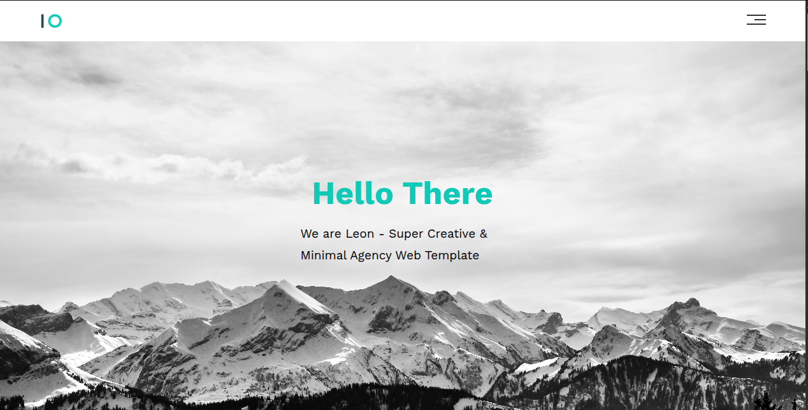

# Leon Template

A responsive HTML & CSS design template built to improve and showcase my CSS skills.

## 🌐 Live Demo

🔗 [View Live Demo](https://abuomersd.github.io/leon-template/)

## Image"

## 📌 Features

- Fully responsive layout
- Clean, modern UI
- Custom CSS Grid & Flexbox layout
- Semantic HTML structure
- Designed from scratch without frameworks

## 🎯 Purpose

This project was created as part of my journey to strengthen my CSS skills by replicating and building real-world layouts. It focuses on:

- Layout techniques using CSS Grid and Flexbox
- Responsive design principles
- Clean and maintainable code structure

## 🛠️ Built With

- HTML5
- CSS3
